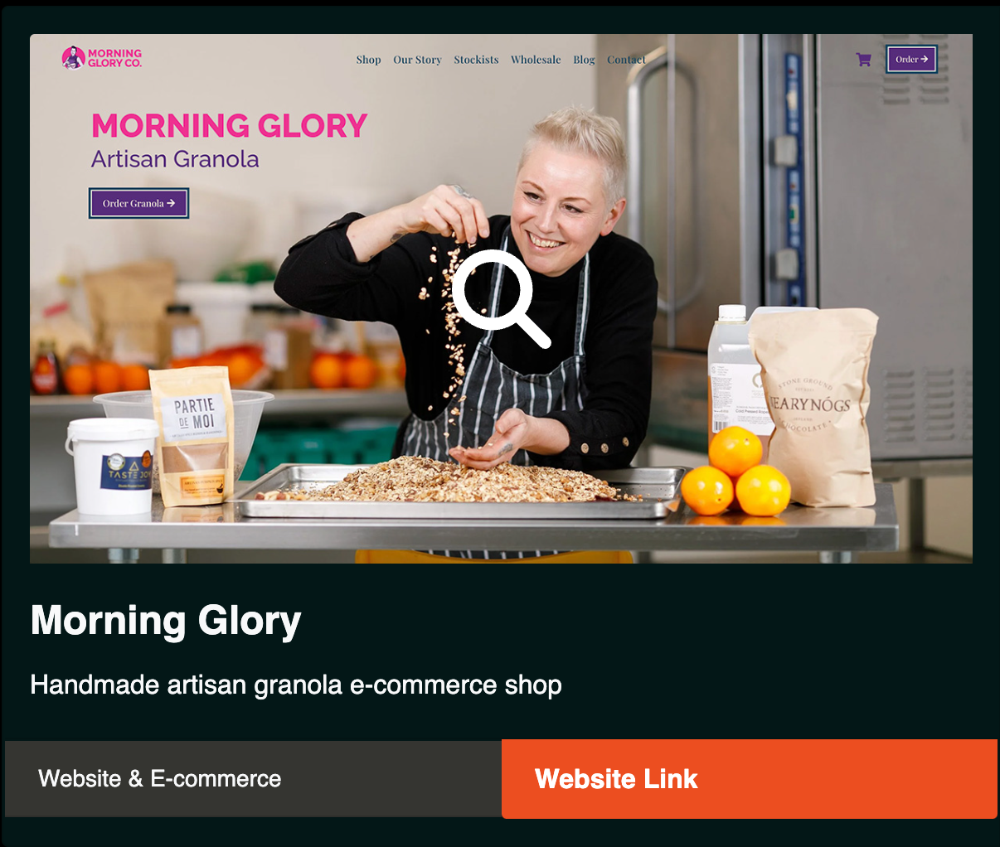

# Seamus's Bootstrap Portfolio

## Description

This is a re-design of my front-end developer portfolio using Bootstrap. The original portfolio can be found [here](https://fawltya.github.io/portfolio).

Re-designing this webpage introduced me to the speed and flexibility of building with bootstrap. My CSS stylesheet is only 89 lines - compared with 438 lines of css in my original portfolio. Having said that my HTML file has increased by around 250 lines. I also noticed I was repeating patterns of bootstrap utility classes (i.e. `d-flex justify-content-center align-items-center text-light`) - whereas one class could have served all of those if using traditional css class methods.

The modal popup was interesting to make and is a great solution for giving the user the option to see the card images in a more zoomed in view.

## Installation

To view the website visit [fawltya.github.io/bootstrap-portfolio](https://fawltya.github.io/bootstrap-portfolio)

## Usage

### Portfolio Cards

Hover over a portfolio card to view a magnifying glass - signifying you should click to see the photo in a larger view. When clicked a lightbox modal is opened with a button to view the full website.

### Contact Form

The contact form has required fields - if you don't fill them in correctly you will be prompted to change your submission.

### Navigation Bar

The navigation bar is sticky - staying at the top of the screen as you scroll (done using the Bootstrap class `sticky-top`). Use the anchor links in the navigation bar to jump to different sections on the page.

## License

MIT License

---
